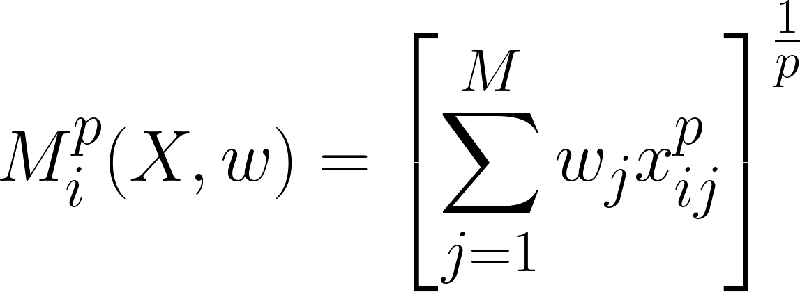

Generalized p-Mean Models
================================

Collection of Generalized *p*-Mean Models (GPMM) with classic, fuzzy and un-weighted approach. This set of outranking methods are based on the concept of `weighted generalized p-mean <https://en.wikipedia.org/wiki/Generalized_mean>`_ of a sequence:

In this project, we have included four different approaches:

1. **Classic (WMM)**: The *M* score is computed per each alternative to generate a cardinal ranking.
2. **Fuzzy (FWMM)**: The decision matrix is trapezoidal fuzzy shaped as *(x_L, x_1, x_2, x_R)* with LR-representation. Then, it is satisfied that *x_L <= x_1 <= x_2 <= x_R* per each component of the matrix.
3. **Un-Weighted (UWMM)**: The weighting scheme is variable and it has attached a lower and upper bound per each component. As a result, it returns an interval *[M_L, M_U]*.
4. **Fuzzy Un-Weighted (FUWMM)**: It combines both approaches in the decision matrix and the weighting scheme.

The mathematical fuzzy LR-representation of a trapezoid *(x_L, x_1, x_2, x_R)* is depicted as follows:

Installation
======================

You can install the uwVIKOR library from GitHub:

.. code:: sh

    git clone https://github.com/Aaron-AALG/GPMM.git
    python3 -m pip install -e GPMM

You can also install it directly from PyPI:

.. code:: sh

    pip install GPMM

Example
======================

GPMM is implemented in order to manage **Pandas** DataFrames as input data which will be converted to **NumPy** arrays. Here is an example in which we only use three alternatives and four criteria:

.. code:: python

    import pandas as pd
    import numpy as np
    from GPMM.methods import *

    data = pd.DataFrame({"c1":[173, 176, 142],
                        "c2":[10, 11, 5],
                        "c3":[11.4, 12.3, 8.2],
                        "c4":[10.01, 10.48, 7.3]})
    directions = ["max", "max", "min", "min"]
    L = np.repeat(0.1, data.shape[1])
    U = np.repeat(0.4, data.shape[1])
    p = 2

    x = GPMM(data, directions, L, U, p)

Optimization in Python
======================

This library uses the `minimize <https://docs.scipy.org/doc/scipy/reference/generated/scipy.optimize.minimize.html>`_ function of the scipy.optimize module to carry out the optimization problems. In particular, *M_L* and *M_U* are obtained one by one, thus we can apply the **SLSQP** method.
